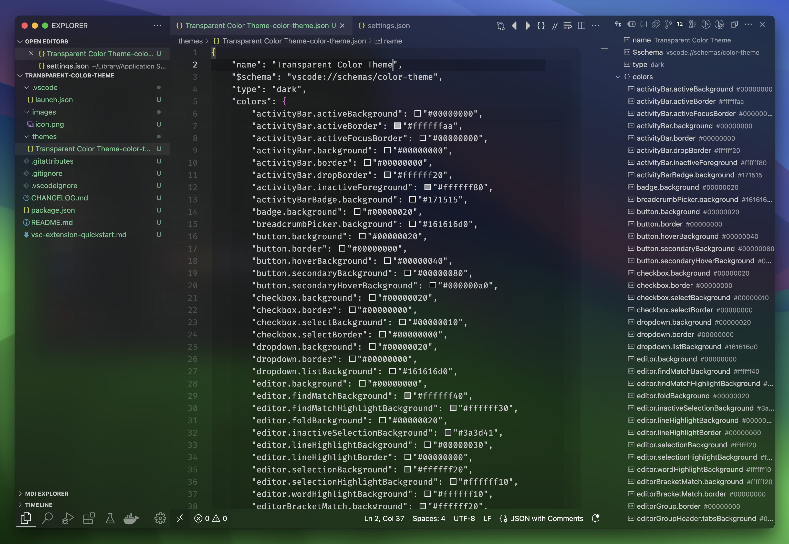

# Transparent Color Theme

</img>

Experience the ultimate coding environment with the Transparent Color theme.
Designed exclusively for macOS, this theme brings the stunning vibrancy
background blur of macOS to Visual Studio Code. Enjoy a sleek and modern coding
experience with translucent backgrounds that seamlessly blend with the rest of
your macOS interface.

## Screenshots



## Installation

1. Launch Visual Studio Code
2. Go to the Extensions view by clicking on the square icon on the left side
   toolbar or by pressing `Ctrl+Shift+X`
3. Search for "Transparent Color Theme" and click on the "Install" button
4. Once the theme is installed, click on the "Reload" button to activate it

## Blur effect

To achieve the transparent effect with Visual Studio Code, you can use the
[Apc Customize UI++](https://marketplace.visualstudio.com/items?itemName=drcika.apc-extension)
extension. It allows you to configure the transparency settings by adding the
following settings to your VS Code settings.json:

```json
"apc.electron": {
    "opacity": 0.95,
    "transparent": true,
    "backgroundColor": "#00000000",
    "vibrancy": "ultra-dark"
}
```

## Theme Details

- **Name**: Transparent Color Theme
- **Version**: 1.0.0
- **VS Code Version**: 1.81.0 and above
- **Keywords**: theme, transparent, macOS, vibrancy, ultra-dark, glass
- **Categories**: Themes
- **Extension Pack**:
  [drcika.apc-extension](https://marketplace.visualstudio.com/items?itemName=drcika.apc-extension)

## Contributing

If you have any suggestions, bug reports, or feature requests, please
[open an issue](https://github.com/AlexOwl/vscode-transparent-color-theme/issues).

## License

This theme is licensed under the [MIT License](LICENSE).
